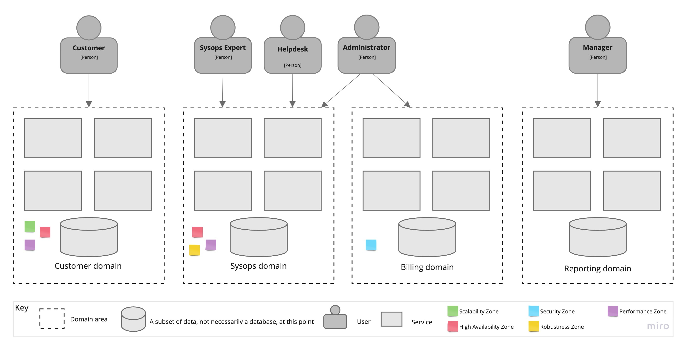

## Title: 
ADR-1: Use Service-based architectural style as the basic style

## Status: 
Proposed

## Context: 
Choose overall architectural approach

## Decision: 
We discovered four main domain areas here each having a separate group of architectural characteristics:

 - Customer-facing services, such as ticket submission and profile management. These require high availability and performance because nothing makes customers so unhappy as a slow or even unavailable system. This part of the system will also have to be scalable because growing the number of customers is the whole key of any business like this. In addition, customer area may be isolated in a separate network zone where only incoming requests are allowed thus improving security.
 - Operational processes, such as knowledge base and ticket workflow. If an expert is unable to search a ticket or knowledge base article when arrived to the customer residence, they might be unable to fix the problem. What can be worse? This subsystem requires a high availability and performance too.
 - Billing services. This is about the customers money. If an attacker will get access to the credit card information it will be a disaster and may have legal implications. This part of the system may need to pass PCI certification, so isolating it from the rest of the system will simplify this procedure a lot. This is an isolated security zone with no incoming requests from the other domains.
 - Administration services, such as user management, analytics and reporting. These people do a very important work but nothing critical will happen if a report generation will take a little longer, or if an administrator will update an expert profile few hour later due to maintenance or something. Security is still important here because admin credentials cannot be exposed, but this is different story from billing security level.

This makes us to think about separate architectural quantas for each of these four domain and Service-based approach seems to be a good shot here. While providing good fault-tolerance, scalability, and agility possibilities it free from cost overhead of Microservices approach.

The other important thing worth mentioning here is that the Service-based style is a good starting point in evolutionary migration from a monolith to a highly distributed architecture, such as Microservices if a new scalability level will become necessary.

## Consequences: 
 - This may require splitting the database.
 - Will need to provide training for the product teams on domains boundaries and responsibilities.
