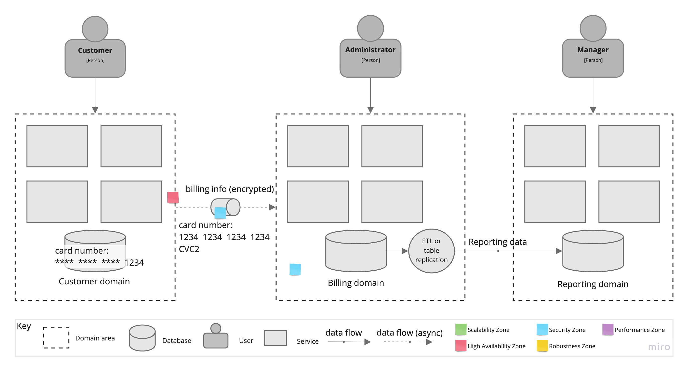

## Title: 
ADR-4: Extract billing architectural quantum

## Status: 
**Proposed**

## Context: 
Billing architectural quantum has very specific security requirements, significantly differentiating it from the rest of the system. Since we store the customer's credit card information in the database (see ASM-4), the system may need to pass a Payment Card Industry (PCI) audit. The bigger part of the system deals with credit card data, the more onerous the procedure is.  
It make sense to isolate the whole billing processing into a separate architectural quantum (as already mentioned in [ADR-1](ADR/ADR-1-service-based.md). Now let's decide how do we do that.

## Decision: 
The problem with isolation the billing sub-system is that billing data is needed by other parts of the system:
* customers want to enter and edit their billing information, including the credit card data;
* administrators need to access the billing system to handle payment processing issues;
* managers want to see the financial reports.

First, let's outline what we include into the billing architectural quantum.

Let's solve these issues one by one. Do customers need to see all their billing details to edit them, like card number, card expiration date, or CVC2? Of course no. It is enough to display the last 4 digits of the credit card number, for example, so that customer will have to remove an existing one and add a new one with all the details. 
When a customer enters a credit card data in the Customer UI, we immediately pass it to the billing quantum and store only the last 4 digits of the credit card number in the customer quantum, leaving all the details secure in the billing quantum.

Administrators will access the billing information via billing UI. As an additional security measure, billing quantum can be hidden behind a virtual network from the rest of the world, then administrators will have to use a VPN client to get access to it.

For managers, we have two options to consider. They can also access the billing UI to analyze the financial reports the same way as administrators do. Or, in case we stick with a separate quantum for reporting and analytics, billing data, that is required for reporting, can be replicated to that quantum on a table basis. In case we want different database vendors for each of these quanta, instead, it can be a background ETL job running in the billing quantum and push reporting data to the other side.

  
## Consequences: 

* Adds complexity.
* We need to ensure that passing of credit card data between quanta is secure. Message brokers typically support TLS, access control and authentication, though require additional development efforts.
