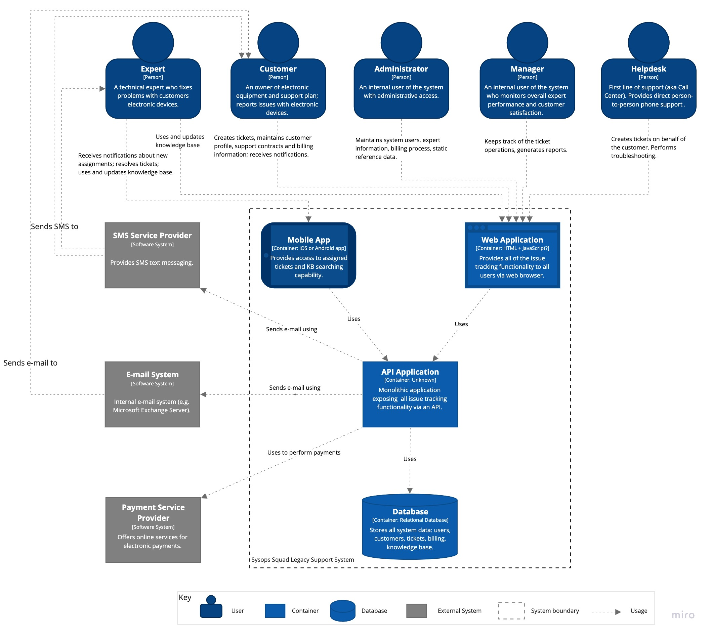
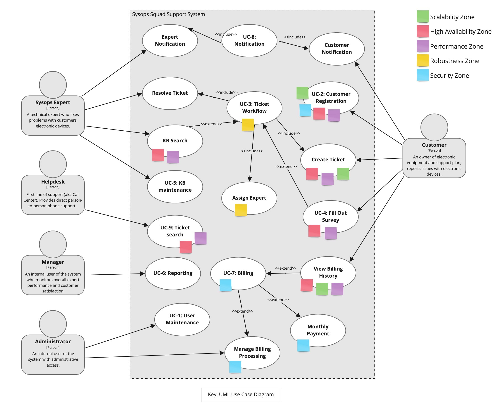
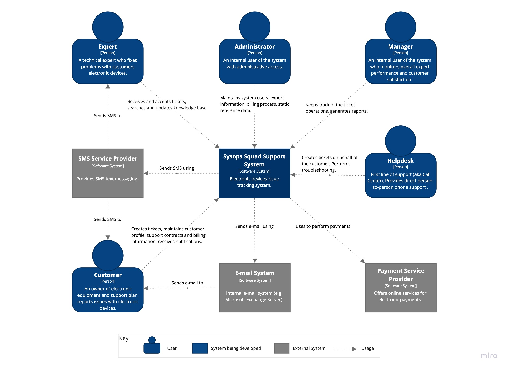
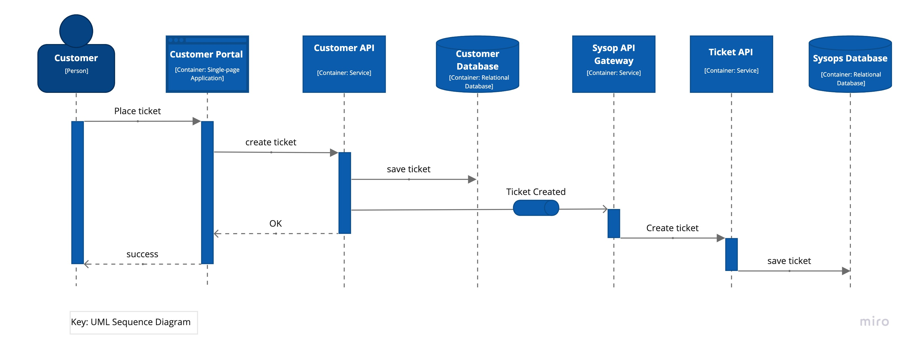
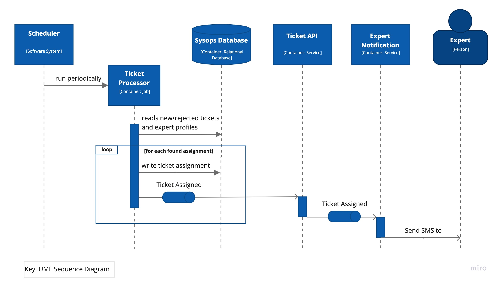
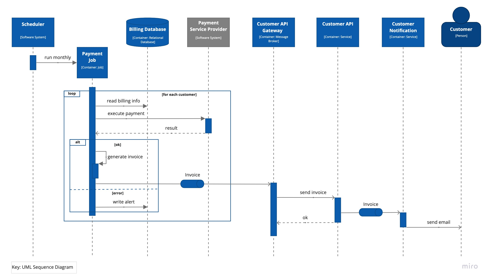
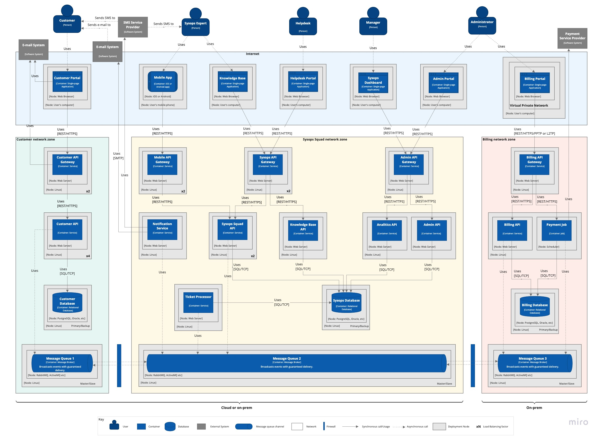

# The Sysops Squad Architectural Kata by O'Reilly

## Team
Name: Team Seven  
Members: Pavel, Suheyl, Nikita, Hassan

Please note that all views are documented in [C4 model](https://c4model.com) style, although only System Context, Container and dynamic views are presented. The most diagrams use informal notation style. All diagrams are supplied with a key explaining meaning of each shape on the diagram.

## Business Case

The business case is described [here](BusinessCase.md)

## Requirements

Functional and quality requirements are described in [this page ](Requirements.md)

## Baseline Architecture

This section describes the architecture of the current ticket system.

The current ticket system demonstrates very poor characteristics of availability, maintainability, deployability and performance. Our goal is to design a new system that solves aforementioned problems.

The following diagram depicts the containers diagram of the current ticket system:

## Target Architecture

This section describes the target software architecture.

### Use Case Model

The following diagram shows mapping of architecture characteristics requirements on the key use cases based on discovered [requirements](Requirements.md):

### System Context

The system context diagram below depicted key users of the system and its external dependencies:

### Containers

The containers diagram that follows shows the high-level shape of the software architecture and how responsibilities are distributed across containers. It also shows the major technology choices and how the containers communicate with one another.

The architecture is build around three main domains that have been discovered during the problem analysis:
 - customer-facing services, such as ticket submission, customer profiles, survey submission etc;
 - expert services, such as ticket acceptance and knowledge base search;
 - administration services, such as reporting, user management, ticket tracking etc.

The architectural style used here as the bases is Service-based with event-driven elements (see [ADR-1](ADR/ADR-1-service-based.md) and [ADR-2](ADR/ADR-2-event-driven-broker.md) for details).

Note that the diagram is focused on domain concerns, so cross-cutting concerns such as logging, authentication, gateways etc, are not present to make the picture more clear.

### Sequences

This section explains some key use cases to demonstrate how corresponding workflows pass through containers.

#### UC-3.1: Ticket submission
The following diagram illustrates the ticket registration workflow by the customer.

#### UC-3.2: Ticket assignment
The diagram below explains how tickets are taken into processing by experts.

#### UC-7: Monthly billing
The diagram illustrates the monthly billing workflow.

### Deployment

The deployment diagram illustrates how the system containers are mapped to the infrastructure:

## Architecture Decision Records

 - [ADR-1](ADR/ADR-1-service-based.md) Use Service-based architectural style as the basic style.
 - [ADR-2](ADR/ADR-2-event-driven-broker.md) Use broker-based event-driven approach with guaranteed delivery for communicating between domains.
 - [ADR-3](ADR/ADR-3-search-expert.md) Expert assignment should be done by a separate component.
 - [ADR-4](ADR/ADR-4-queuing-the-problem-tickets.md) Queue the problem tickets.
 - [ADR-5](ADR/ADR-5-problem-tickets.md) Handling the problem tickets separately, Isolating from the rest of the system.
 - [ADR-6](ADR/ADR-6-separate-customer-db.md) Use separate customer database.
 - [ADR-7](ADR/ADR-7-separate-experts-db.md) Use separate expert database.
 - [ADR-8](ADR/ADR-8-messaging-sync.md) Use message-based synchronization of customer data and ticket assignments.
 - [ADR-9](ADR/ADR-9-notification-service.md) Extract notification service.
