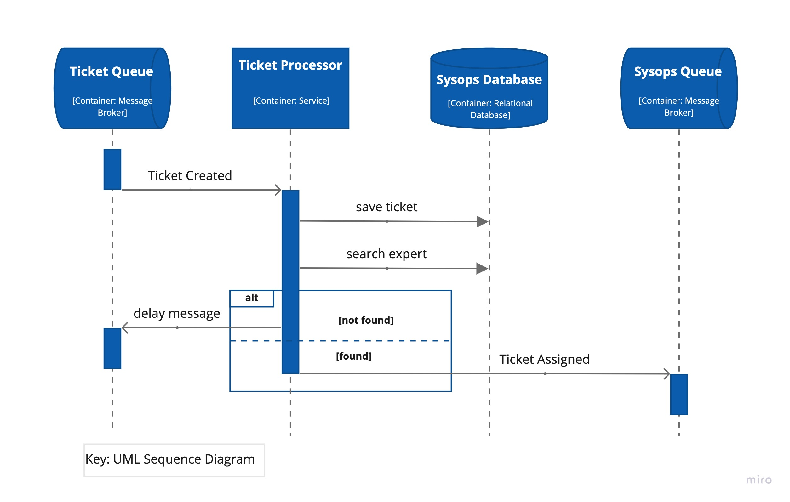
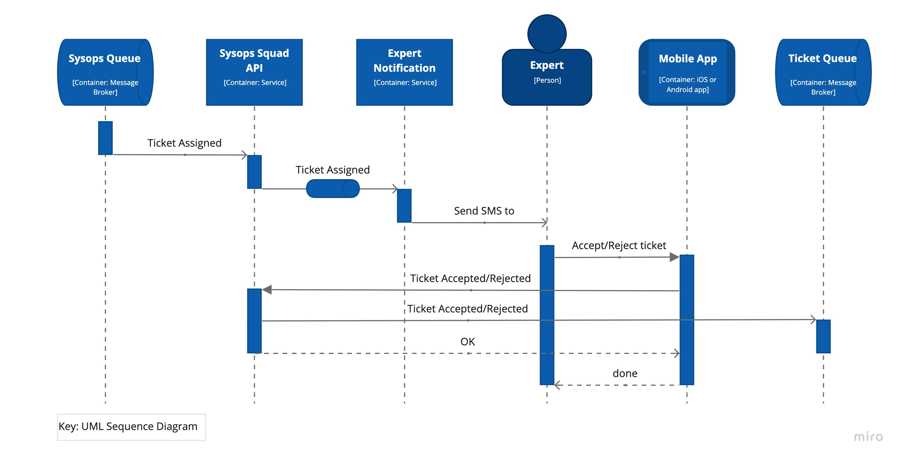
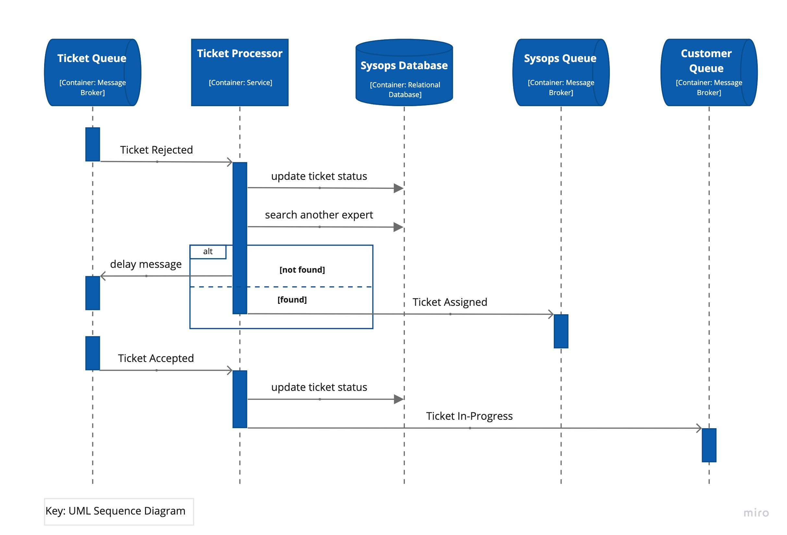
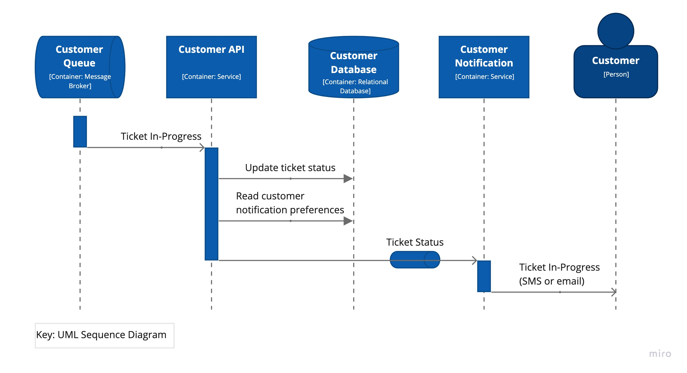
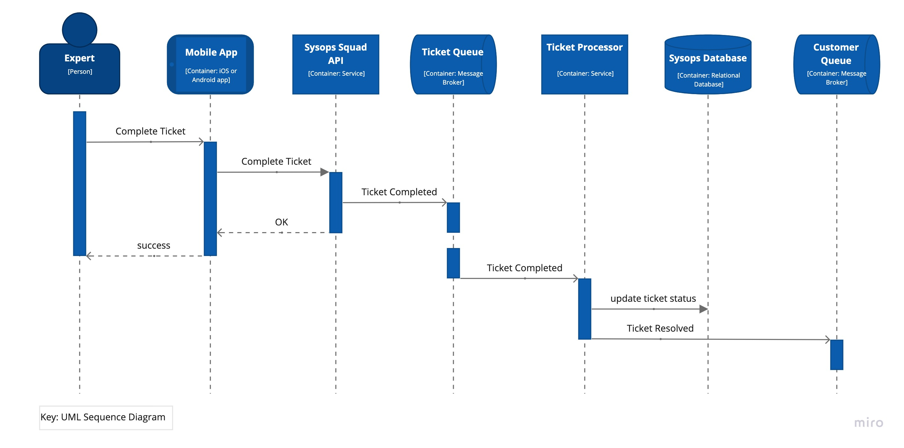
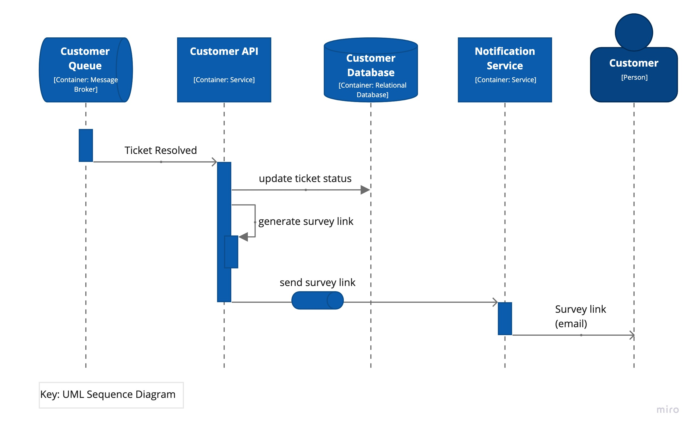
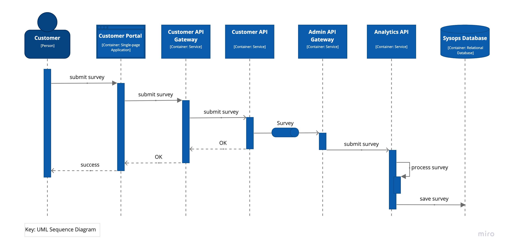

# The Sysops Squad Architectural Kata by O'Reilly 2021

## Team Seven

**Pavel, Suheyl, Nikita, Hassan**

## Contents

- [Welcome](#welcome)  
- [Business Case](#business-case)  
- [System Requirements](#system-requirements)  
    - [Functional Requirements](#functional-requirements)
    - [Architecture Characteristics Requirements](#architecture-characteristics-requirements)
    - [Constraints](#constraints)
    - [Assumptions](#assumptions)
- [Baseline Architecture](#baseline-architecture)  
- [Target Architecture](#target-architecture)  
    - [Use Case Model](#use-case-model)  
    - [System Context](#system-context)  
    - [Containers](#containers)  
    - [Process Views](#process-views)  
    - [Deployment](#deployment)  
- [Migration Plan](#migration-plan)
- [Architecture Decision Records](#architecture-decision-records)

## Welcome
> *Everything in software architecture is a trade-off.  
First Law of Software Architecture*

Welcome to the Sysops Squad Architectural Kata run by O'Reilly in May 2021.

This page is architectural documentation for the solution presented by **Team Seven**.

### About the name

Magic number Seven... This is not a random number in our name. This number joined our team together. One of us has a birthday at 07/07 thus joined the Team Seven. Somebody had a successful career in a football team under number 7 thus joined the Team Seven. Somebody believes that this is his lucky number throughout the whole life.  
And of course, the average number of services in Service-based architecture that we defined as our initial candidate, is about 7.
That's why we decided to make this number a symbol of our team.

## Business Case

Penultimate Electronics is a large electronics giant that has numerous retail stores throughout the country. When customers buy computers, TV's, stereos, and other electronic equipment, they can choose to purchase a support plan. Customer-facing technology experts (the "Sysops Squad") will then come to the customers residence (or work office) to fix problems with the electronic device.

The current trouble ticket system is a large monolithic application that was developed many years ago. Customers are complaining that consultants are never showing up due to lost tickets, and often times the wrong consultant shows up to fix something they know nothing about. Customers and call-center staff have been complaining that the system is not always available for web-based or call-based problem ticket entry. Change is difficult and risky in this large monolith - whenever a change is made, it takes too long and something else usually breaks. Due to reliability issues, the monolithic system frequently "freezes up" or crashes - they think it's mostly due a spike in usage and the number of customers using the system. If something isn't done soon, Penultimate Electronics will be forced to abandon this very lucrative business line and fire all of the experts.

## System Requirements

### Functional Requirements

* **UC-1**: **User maintenance**:
    - administrator maintains internal user accounts;
    - administrator maintains expert skillset, location, and availability;

* **UC-2**: **Customer registration**:
    - customers register their profile, credit card and support plan;

* **UC-3**: **Ticket workflow**:
    - customers submit tickets via web or by phone call (admins assist);
    - experts use mobile app to read ticket and change ticket status;
    - experts can search knowledge base via mobile app;

* **UC-4**: Survey submission:
    - customers fill out and submit satisfaction surveys;

* **UC-5**: **Knowledge base maintenance**:
    - experts update knowledge base;

* **UC-6**: **Reporting**:
    - managers track ticket operations;
    - managers generate reports: financial, expert performance, ticketing;

* **UC-7**: **Billing**:
    - customers are billed automatically (monthly);
    - customers can view their billing history and statements;
    - administrator manages billing processing for customers;

* **UC-8**: **Notification**:
    - customers receive SMS or email about expert assignment;
    - customers receive email with a link to survey web form;
    - experts receive SMS about ticket assignment;

* UC-9: Ticket search:
    - helpdesk users need access to the ticket base to clarify ticket status;

### Architecture Characteristics Requirements

* **QA-1**: **scalability** (UC-3)
    - country scale geography (USA?);
    - number of customers - millions;
    - number of tickets per customer <= 100 (let's assume something crazy);

* **QA-2**: **availability** (UC-2, UC-3, UC-4)
    - customer-facing services and KB must be highly available because outages will make a negative impact on business;
    - 99.9% seems reasonable here;

* **QA-3**: **performance** (UC-2, UC-3, UC-6)
    - response time < 2s for page load;
    - knowledge search time several seconds;
    - reports generation should not take an excessive amount of time;

* **QA-4**: **robustness** (UC-3)
    - lost tickets or wrong experts may lead to the business closure;

* **QA-5**: **security** (UC-2, UC-7)
    - customer personal information and credit cards should be stored in secure and comply to PCI requirements;

* **QA-6**: **deployability** (all use cases)
    - deployments should be safe and avoid regression in unrelated components;

### Constraints
* **CON-1**: Integration? Cloud/on-prem?

### Assumptions
* **ASM-1**: The mobile app can be changed.
* **ASM-2**: Helpdesk assistants (aka Call Center) need access to the ticket sub-system and some customer information (contacts, maybe support plan). These are also users of the system although are not listed in the "Main Four Users" of the original requirements.
* **ASM-3**: Call tracking system is out of scope of Sysops Squad system.
* **ASM-4**: The company stores customer credit card information locally and does not interoperate with a 3-party authority (like 

## Baseline Architecture
This section describes the architecture of the current ticket system.

Please note that all views are documented in [C4 model](https://c4model.com) style, although only System Context, Container and dynamic views are presented. The most diagrams use informal notation style. All diagrams are supplied with a key explaining meaning of each shape on the diagram.

The current ticket system demonstrates very poor characteristics of availability, maintainability, deployability and performance. Our goal is to design a new system that solves aforementioned problems.

The following diagram depicts the containers diagram of the current ticket system:

## Target Architecture
This section describes the target software architecture.

Please note that all views are documented in [C4 model](https://c4model.com) style, although only System Context, Container and dynamic views are presented. The most diagrams use informal notation style. All diagrams are supplied with a key explaining meaning of each shape on the diagram.

### Use Case Model

The following diagram shows mapping of architecture characteristics requirements on the key use cases based on discovered [requirements](Requirements.md):

### System Context

The system context diagram below depicted key users of the system and its external dependencies:

### Containers

The containers diagram that follows shows the high-level shape of the software architecture and how responsibilities are distributed across containers. It also shows the major technology choices and how the containers communicate with one another.

The architecture is build around three main domains that have been discovered during the problem analysis:
 - customer-facing services, such as ticket submission, customer profiles, survey submission etc;
 - expert services, such as ticket acceptance and knowledge base search;
 - administration services, such as reporting, survey analysis, ticket tracking etc.

The architectural style used here as the bases is Service-based with event-driven elements (see [ADR-1](ADR/ADR-1-service-based.md) and [ADR-2](ADR/ADR-2-event-driven-broker.md) for details).

### Process Views

This section explains some key use cases to demonstrate how corresponding workflows pass through containers.

#### UC-3: Ticket submission
The following diagram illustrates the ticket registration by the customer.

**Note** that Gateway APIs are intentionally omitted to reduce clutter. Those are simple pass-through services that perform operational tasks.

#### UC-3: Ticket Created event
The diagram below explains how the system processes a new ticket and assigns it an expert.

**Note** that Gateway APIs are intentionally omitted to reduce clutter. Those are simple pass-through services that perform operational tasks.

If an expert cannot be found at the given moment, Ticket Processor will have to work on that ticket once again later - maybe some expert will be freed from the job, or a new expert will appear in the system. Depending on the technology chosen, "delay message" can be implemented in different ways. This can be a native message broker's feature that enables message rescheduling (both RabbitMQ and ActiveMQ support that by the way).

Or, if the message broker does not support that or it is tricky to use, the new event can be rescheduled by using a scheduler, like cron. Anyway, the idea here is that the ticket cannot be forgotten and Ticket Processor has to work on it until an appropriate expert will be found. A manager will pay attention to tickets that stay pending too long and can take some manual action to help the situation.

#### UC-3: Ticket Assigned
This diagram continues the ticket workflow and shows how the Ticket Assigned event is processed by the Sysops Expert user.

**Note** that Gateway APIs are intentionally omitted to reduce clutter. Those are simple pass-through services that perform operational tasks.

#### UC-3: Ticket Accepted/Rejected
This diagram illustrates what happens when the Sysops Expert either accepts or rejects the ticket.

**Note** that Gateway APIs are intentionally omitted to reduce clutter. Those are simple pass-through services that perform operational tasks.

#### UC-3: Ticket In-Progress
This diagram demonstrates how the customer is notified when the Sysops Expert accepted the ticket.

**Note** that Gateway APIs are intentionally omitted to reduce clutter. Those are simple pass-through services that perform operational tasks.

#### UC-3: Ticket Completed
This diagram explains the process when the Sysops Expert solved the problem and marked the ticket as completed.

**Note** that Gateway APIs are intentionally omitted to reduce clutter. Those are simple pass-through services that perform operational tasks.

#### UC-3: Ticket Resolved
This diagram illustrates how the customer receives a notification about the ticket resolution and link to the survey form.

**Note** that Gateway APIs are intentionally omitted to reduce clutter. Those are simple pass-through services that perform operational tasks.

#### UC-4: Survey Submission

And finally the last step in the ticket resolution flow is survey submission by the customer.

**Note** that Gateway APIs are intentionally omitted to reduce clutter. Those are simple pass-through services that perform operational tasks.

#### UC-7: Monthly billing
The diagram illustrates the monthly billing workflow.

### Deployment

The deployment diagram illustrates how the system containers are mapped to the infrastructure:

Note the colors have not special meaning, they are just to distinguish thing from one another.

The deployment strategy here is cloud-agnostic, assuming you can use any cloud provider of your choice or stay totally on-prem. An exception is the billing stuff, which is recommended to remain on-prem anyway for security considerations.

## Migration Plan
TBD

## Architecture Decision Records

 - [ADR-1](ADR/ADR-1-service-based.md) Use Service-based architectural style as the basic style.
 - [ADR-2](ADR/ADR-2-event-driven-broker.md) Use message queues with guaranteed delivery for ticket workflow.
 - [ADR-3](ADR/ADR-3-search-expert.md) Extract ticket processing into a separate service.
 - [ADR-6](ADR/ADR-6-separate-customer-db.md) Use separate customer database.
 - [ADR-9](ADR/ADR-9-notification-service.md) Extract notification service.
 - [ADR-10](ADR/ADR-10-modular-services.md) Use sub-domain partitioning for service design.
 - [ADR-11](ADR/ADR-11-extract-payment-job.md) Extract payment processing into a separate component (Payment Job).
 - [ADR-12](ADR/ADR-12-gateways.md) Offload operational concerns into API Gateways.
