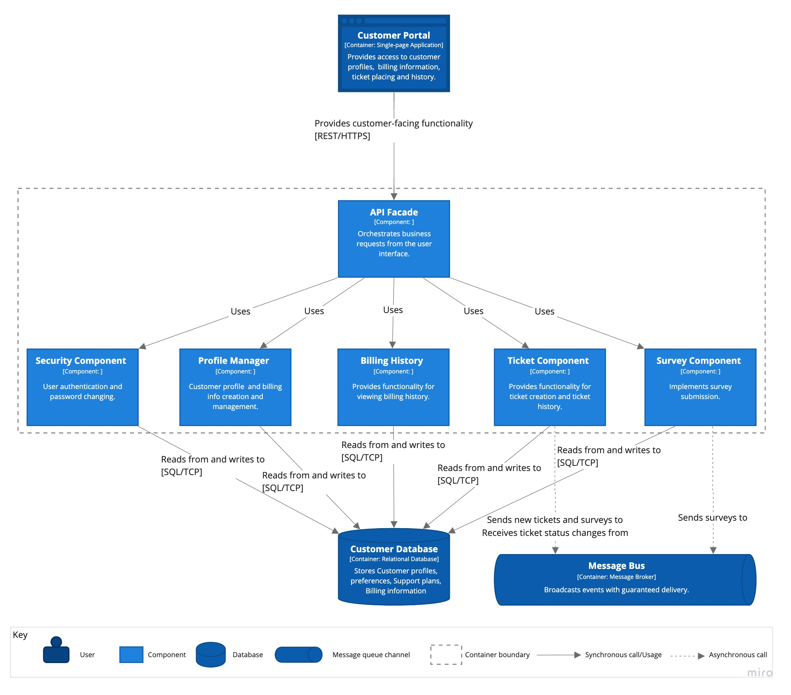
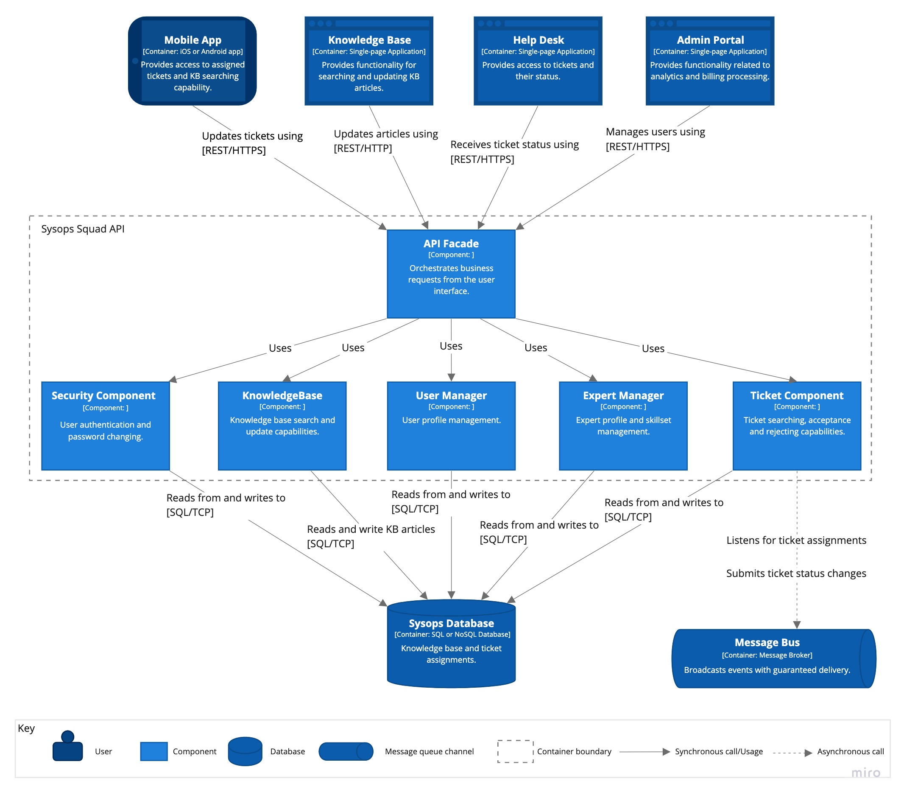
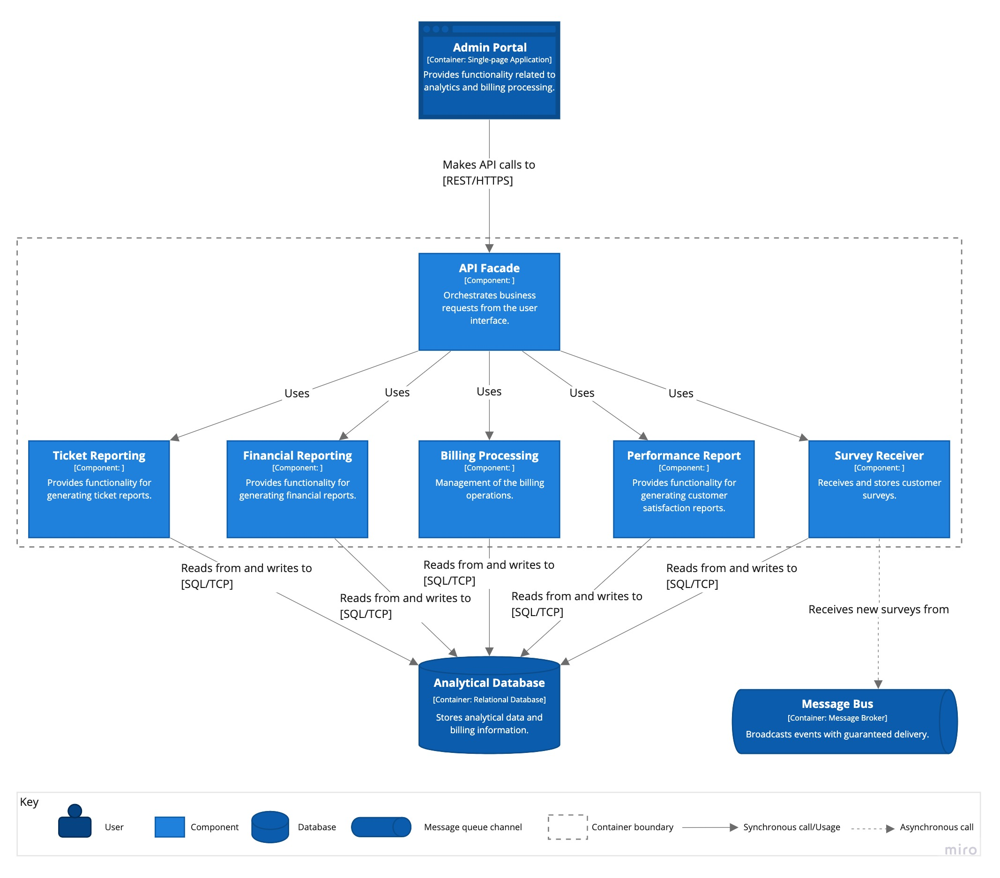
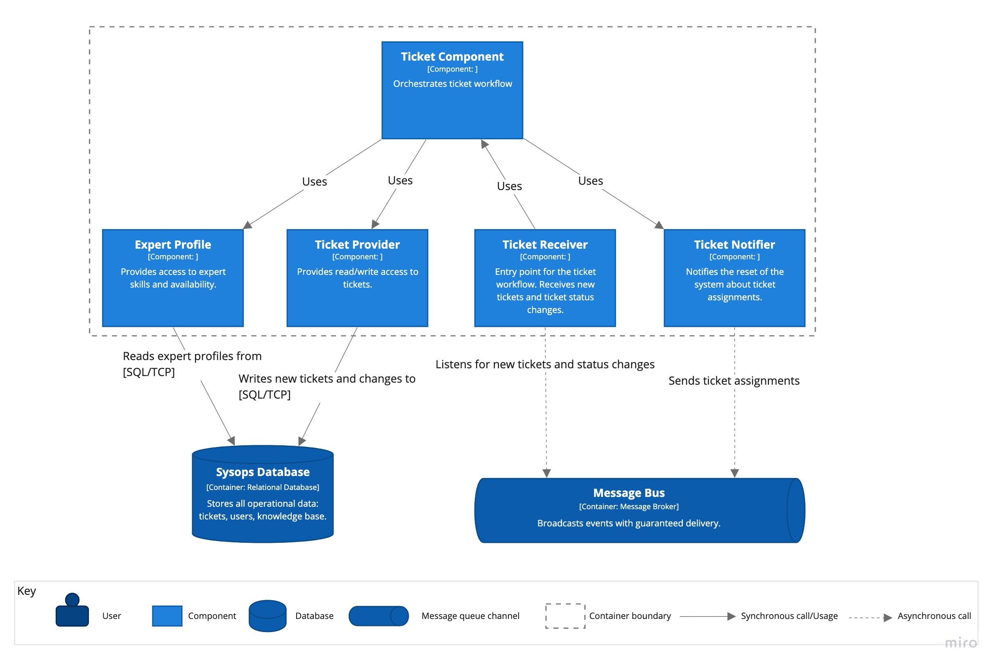

# The Sysops Squad Architectural Kata by O'Reilly

## Contents

- [Team](#team)  
- [Business Case](#business-case)  
- [Requirements](#requirements)  
- [Baseline Architecture](#baseline-architecture)  
- [Target Architecture](#target-architecture)  
    - [Use Case Model](#use-case-model)  
    - [System Context](#system-context)  
    - [Containers](#containers)  
    - [Components](#components)  
    - [Process Views](#process-views)  
    - [Deployment](#deployment)  
- [Migration Plan](#migration-plan)
- [Architecture Decision Records](#architecture-decision-records)

## Team Seven
Pavel, Suheyl, Nikita, Hassan

### About the name

Magic number Seven... This is not a random number in our name. This number joined our team together. One of us has a birthday at 07/07 thus joined the Team Seven. Somebody had a successful career in a football team under number 7 thus joined the Team Seven. Somebody believes that this is his lucky number throughout the whole life.  
And of course, the average number of services in Service-based architecture that we defined as our initial candidate, is about 7.
That's why we decided to make this number a symbol of our team.

## Business Case

The business case is described [here](BusinessCase.md)

## Requirements

Functional and quality requirements are described in [this page ](Requirements.md)

## Baseline Architecture
This section describes the architecture of the current ticket system.

Please note that all views are documented in [C4 model](https://c4model.com) style, although only System Context, Container and dynamic views are presented. The most diagrams use informal notation style. All diagrams are supplied with a key explaining meaning of each shape on the diagram.

The current ticket system demonstrates very poor characteristics of availability, maintainability, deployability and performance. Our goal is to design a new system that solves aforementioned problems.

The following diagram depicts the containers diagram of the current ticket system:

## Target Architecture
This section describes the target software architecture.

Please note that all views are documented in [C4 model](https://c4model.com) style, although only System Context, Container and dynamic views are presented. The most diagrams use informal notation style. All diagrams are supplied with a key explaining meaning of each shape on the diagram.

### Use Case Model

The following diagram shows mapping of architecture characteristics requirements on the key use cases based on discovered [requirements](Requirements.md):

### System Context

The system context diagram below depicted key users of the system and its external dependencies:

### Containers

The containers diagram that follows shows the high-level shape of the software architecture and how responsibilities are distributed across containers. It also shows the major technology choices and how the containers communicate with one another.

The architecture is build around three main domains that have been discovered during the problem analysis:
 - customer-facing services, such as ticket submission, customer profiles, survey submission etc;
 - expert services, such as ticket acceptance and knowledge base search;
 - administration services, such as reporting, survey analysis, ticket tracking etc.

The architectural style used here as the bases is Service-based with event-driven elements (see [ADR-1](ADR/ADR-1-service-based.md) and [ADR-2](ADR/ADR-2-event-driven-broker.md) for details).

### Components
This section provides component decomposition of some key containers of the system.

#### Customer API
The following diagram illustrates components of the Customer API.

#### Sysops Squad API
The following diagram describes components of the Sysops Squad API.

#### Administration API
The following diagram describes components of the Administration API.

#### Ticket Processor
The following diagram describes components of the Ticket Processor.

#### Notification Service
The following diagram describes components of the Notification Service.

### Process Views

This section explains some key use cases to demonstrate how corresponding workflows pass through containers.

#### UC-3: Ticket submission
The following diagram illustrates the ticket registration by the customer.

**Note** that Gateway APIs are intentionally omitted to reduce clutter. Those are simple pass-through services that perform operational tasks.

#### UC-3: Ticket Created event
The diagram below explains how the system processes a new ticket and assigns it an expert.

**Note** that Gateway APIs are intentionally omitted to reduce clutter. Those are simple pass-through services that perform operational tasks.

#### UC-3: Ticket Assigned
This diagram continues the ticket workflow and shows how the Ticket Assigned event is processed by the Sysops Expert user.

**Note** that Gateway APIs are intentionally omitted to reduce clutter. Those are simple pass-through services that perform operational tasks.

#### UC-3: Ticket Accepted/Rejected
This diagram illustrates what happens when the Sysops Expert either accepts or rejects the ticket.

**Note** that Gateway APIs are intentionally omitted to reduce clutter. Those are simple pass-through services that perform operational tasks.

#### UC-3: Ticket In-Progress
This diagram demonstrates how the customer is notified when the Sysops Expert accepted the ticket.

**Note** that Gateway APIs are intentionally omitted to reduce clutter. Those are simple pass-through services that perform operational tasks.

#### UC-3: Ticket Completed
This diagram explains the process when the Sysops Expert solved the problem and marked the ticket as completed.

**Note** that Gateway APIs are intentionally omitted to reduce clutter. Those are simple pass-through services that perform operational tasks.

#### UC-3: Ticket Resolved
This diagram illustrates how the customer receives a notification about the ticket resolution and link to the survey form.

**Note** that Gateway APIs are intentionally omitted to reduce clutter. Those are simple pass-through services that perform operational tasks.

#### UC-4: Survey Submission

And finally the last step in the ticket resolution flow is survey submission by the customer.

**Note** that Gateway APIs are intentionally omitted to reduce clutter. Those are simple pass-through services that perform operational tasks.

#### UC-7: Monthly billing
The diagram illustrates the monthly billing workflow.

### Deployment

The deployment diagram illustrates how the system containers are mapped to the infrastructure:

## Migration Plan
TBD

## Architecture Decision Records

 - [ADR-1](ADR/ADR-1-service-based.md) Use Service-based architectural style as the basic style.
 - [ADR-2](ADR/ADR-2-event-driven-broker.md) Use message queues with guaranteed delivery for ticket workflow.
 - [ADR-3](ADR/ADR-3-search-expert.md) Separate service for ticket processing.
 - [ADR-4](ADR/ADR-4-queuing-the-problem-tickets.md) Queue the problem tickets.
 - [ADR-6](ADR/ADR-6-separate-customer-db.md) Use separate customer database.
 - [ADR-7](ADR/ADR-7-separate-experts-db.md) Analytics/reporting database.
 - [ADR-8](ADR/ADR-8-messaging-sync.md) Use table-based synchronization of customer billing info.
 - [ADR-9](ADR/ADR-9-notification-service.md) Extract notification service.
 - [ADR-10](ADR/ADR-10-modular-services.md) Use sub-domain partitioning for service design.
 - [ADR-11](ADR/ADR-11-extract-payment-job.md) Extract payment processing into a separate component (Payment Job).
 - [ADR-12](ADR/ADR-12-gateways.md) Offload operational concerns into API Gateways.
